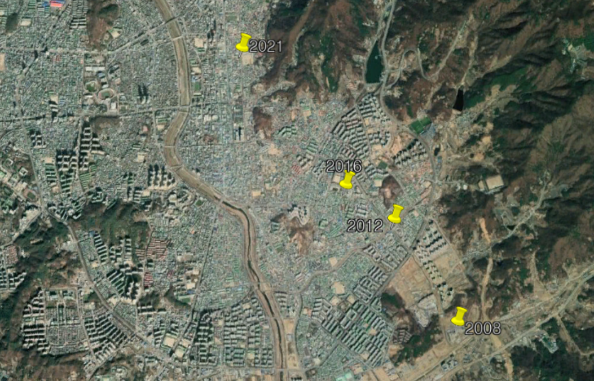
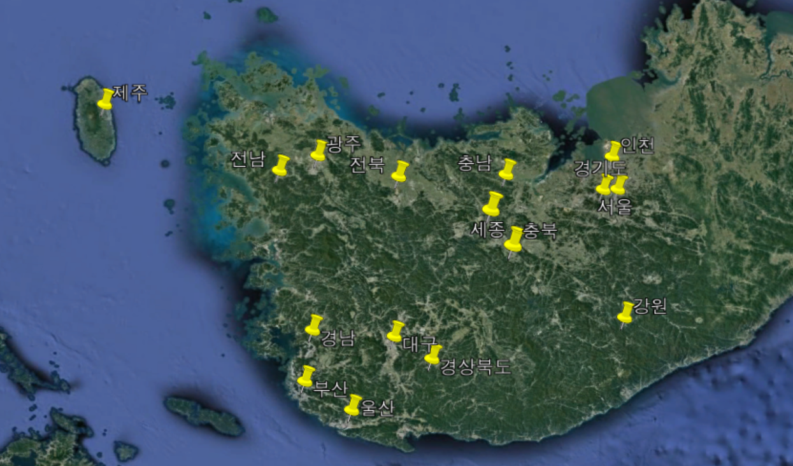

# 인구 중심 구하기

- 청록색 사이트를 구경하다가, '인구 중심'개념을 목격함.
    위치를 인구에 대해 가중평균한 것.
- 관련 기사: [한국 인구의 중심 청원군 남일면 | 주간동아, 2008.12.01](https://weekly.donga.com/List/3/all/11/86443/1)
- 관련 논문: [김재태 이낙영 오미애 이상인. (2018) 우리나라  인구이동  및  인구중심의  변천에  관한  연구. 통계연구(2018),  제23권  제3호,  1-23](http://www.kostat.go.kr/file_total/eduSri/23-3-01.pdf)
- 직접 구하기로 마음먹음

## 자료 얻기
### 주민 수
- 주민수는 행정안전부의 [주민등록인구통계](https://jumin.mois.go.kr/)를 사용함.
- 대충 다음과 같은 데이터를 얻음.

|행정기관코드|행정기관|총인구수|세대수|세대당 인구|남자 인구수|여자 인구수|남여 비율|
|-|-|-|-|-|-|-|-|
|1100000000|서울특별시  |9,575,355|4,403,381|2.17|4,654,720|4,920,635|0.95|
|1111000000|서울특별시 종로구 |146,377|73,712|1.99|71,204|75,173|0.95|

- .xlsx로 받은 뒤, .csv로 변환함.
- 이제, 각 읍면동의 좌표를 얻자.
- 주민의 평균은, 각 읍면동의 평균이라고 가정한 것임.
- 지구의 곡률은 무시한다.

### 읍면동 위치
- [구글지도](maps.google.com/)에서 가져옴.
- 지도 검색창에 자동완성 기능이 있는데, 이 기능을 이용해서 데이터를 가져옴.
- 파이썬 requests으로 요청하니까, 유저 에이전트를 넣었음에도 429에러가 뜸.
- 브라우져 콘솔창에서 자바스크립트를 이용해, fetch API로 전송함.

#### 자바스크립트 코드

```javascript
function get_cold(name){
name = name.trim()
var nameu = encodeURI(name);
fetch(`https://www.google.com/s?tbm=map&gs_ri=maps&[생략]&q=${nameu}&[생략]`)
    .then((data)=>{return data.text()})
    .then((data)=>{
    eval('var k = '+data)
    console.log(k['d'].substr(4).replace(/null,/g,''))
    var kk = eval(k['d'].substr(4).replace(/null,/g,''))[0][1][0][0][6];        
    console.log(name, kk.toString())
    dict.push([name, kk.toString()])
})
}
```
* fetch 사용하는 부분.

```javascript
eval('var k = '+data)
var dict = [];
var cnt = 0;
var id = setInterval(()=>{
    get_cold(a[cnt])
    cnt++;
    if (cnt >= a.length) clearInterval(id);
},300)
```
* 돌리는 부분

- 자동완성이 안 되는 경우, 지역명이 바뀌는 경우는 수동으로 추가.

#### csv 파일로 변환
- python을 이용해서 csv 형태로 변환.
- 중심좌표.csv로 저장.
- 변환한 csv파일의 내부는 대충 다음과 같음.

|행정기관코드|행정기관|위도|경도|
|-|-|-|-|
|1100000000|서울특별시||서울특별시|
|1111000000|서울특별시 종로구|37.5729503|126.9793579|
|1111051000|서울특별시 종로구 청운동|37.5893662|126.9697192|
|1111051500|서울특별시 종로구 청운효자동|37.5840608|126.9705804|

## 분석하기
- python, jupyter notebook을 이용함.
- 내장된 csv 모듈을 이용해서 분석.
- BOM 문자(?)는 `f = open(filename+'.csv','r',encoding='utf-8-sig')`를 이용해 처리
- 간단한 산술연산.
- 얻은 좌표는, 구글어스로 시각화. (kml 파일로 만들면 더 좋을듯.)

## 결과

- 전국

- 광역
